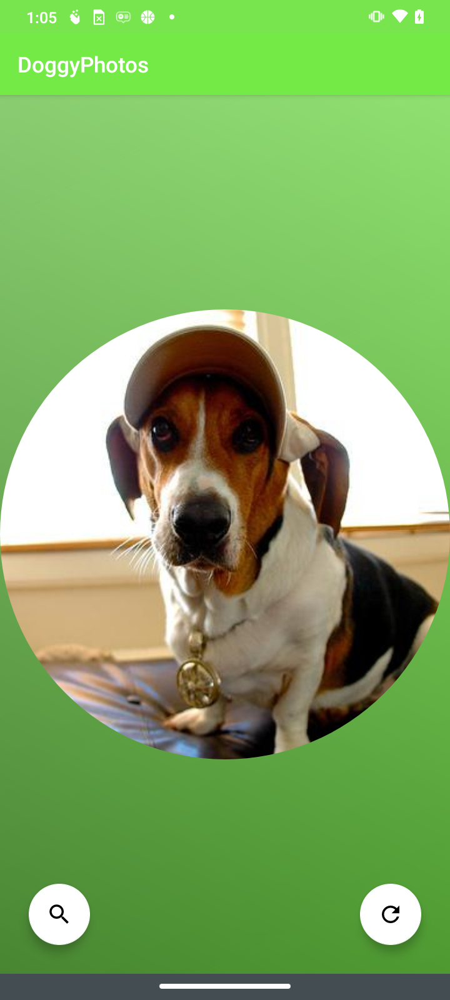
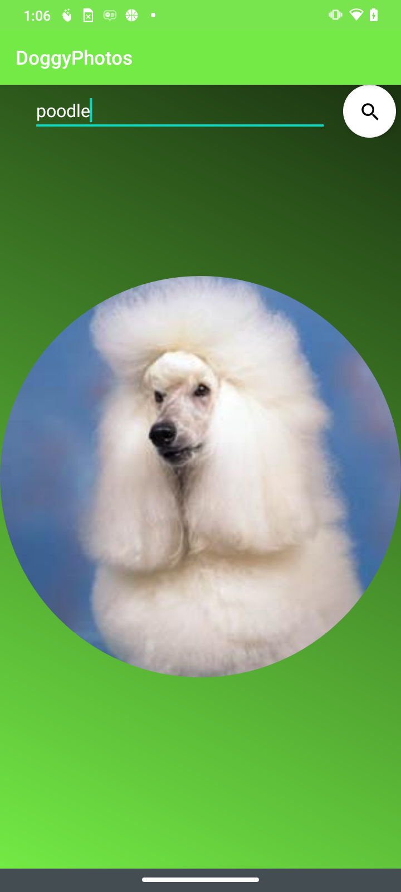

# DoggyPhotos

An Android application to showcase dog images. The application allows users to see
random dog images or random dog images by breed. The application consumes
data from the [Dog Ceo API](https://dog.ceo/api/)

Minimum Api Level : 22

compileSdkVersion : 31

Build System : [Gradle](https://gradle.org/)

## Table of Contents

- [Architecture](#architecture)
- [Libraries](#libraries)
- [Demo](#demo)

## Architecture

The application is built using Single-Activity Architecture with multiple fragments. I split the application into 4 layers:

- API
- Models
- UI
- Utils

### Android Architecture Components

- LiveData
- ViewModel
- Navigation

### Concurrency

- Coroutines

## Libraries

#### Third-Party
- [Glide](https://github.com/bumptech/glide) - Image loading
- [Moshi](https://github.com/square/moshi) - JSON deserialization
- [Retrofit 2](https://square.github.io/retrofit/) - REST API access

## Demo

|||

